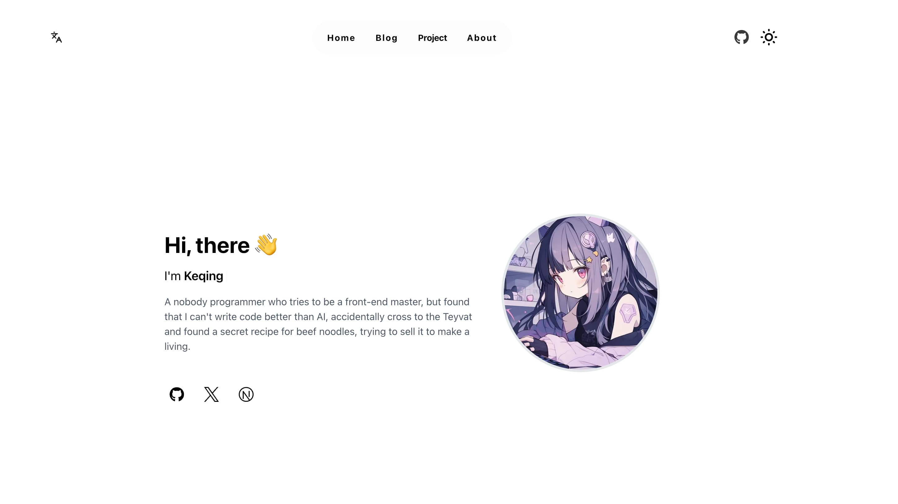

<h1 align="center">HomePage</h1>

<p align="center"><b>Build with Next.js and TailwindCSS</b></p>
<p align="center">
  
  
  
  
  <br/>

</p>

## Preview



## Quick Start

> Please make sure you have the following environment, docker version will available soon.

- node.js > v20
- pnpm > v9

### Start

```bash
pnpm install

pnpm dev
```

### Deploy

```bash
next build
```

## License

This project is licensed under the [MIT](./LICENSE) License.
